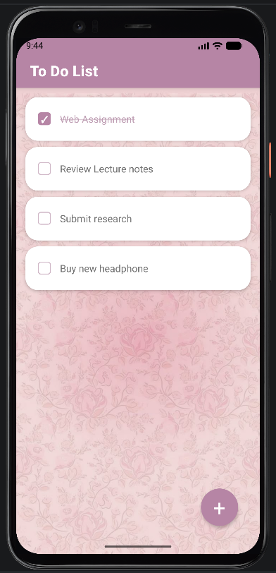
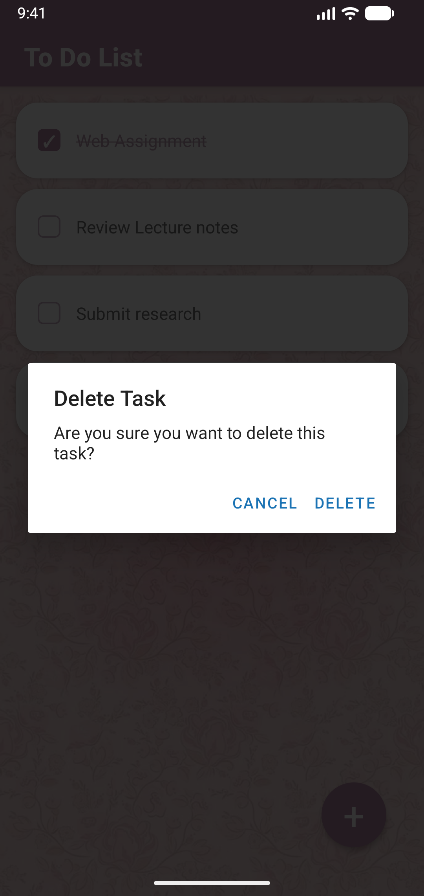

# 🌸 To Do List

A cute and aesthetic notes/task management mobile app built using React Native and Expo ✨  
Designed with a soft pink UI and clean modern layout for a smooth user experience.

---

## 📱 Features

- ➕ Add new tasks
- ✔ Mark tasks as completed
- 🗑 Delete tasks (with confirmation dialog)
- 💾 Persistent local storage using AsyncStorage
- 🎀 Minimal aesthetic UI
- 🪟 Modal-based task input system
- 📜 Scrollable task list
- ⚡ Real-time task rendering
- 📱 Built with React Native + Expo

## Demo
[Screen_recording_20260905_080335.webm](https://github.com/user-attachments/assets/ba660e6b-d3a1-444d-b9a0-ab0cb90f3c76)

## 📸 Screenshots

<p align="center">
  
  &nbsp;&nbsp;&nbsp;
  
</p>

<p align="center">
  <em>Main task list</em>&nbsp;&nbsp;&nbsp;&nbsp;&nbsp;&nbsp;&nbsp;&nbsp;&nbsp;&nbsp;&nbsp;&nbsp;&nbsp;&nbsp;&nbsp;<em>Delete confirmation dialog</em>
</p>

---

## 🛠 Tech Stack

- React Native
- Expo
- TypeScript
- AsyncStorage

---

🌸 Future Improvements

Planned features for future updates:

✏ Edit existing tasks
🎬 UI animations
📊 Task statistics
☁ Cloud synchronization
🌙 Dark mode

==============================================

# Welcome to your Expo app 👋

This is an [Expo](https://expo.dev) project created with [`create-expo-app`](https://www.npmjs.com/package/create-expo-app).

## Get started

1. Install dependencies

   ```bash
   npm install
   ```

2. Start the app

   ```bash
   npx expo start
   ```

In the output, you'll find options to open the app in a

- [development build](https://docs.expo.dev/develop/development-builds/introduction/)
- [Android emulator](https://docs.expo.dev/workflow/android-studio-emulator/)
- [iOS simulator](https://docs.expo.dev/workflow/ios-simulator/)
- [Expo Go](https://expo.dev/go), a limited sandbox for trying out app development with Expo

You can start developing by editing the files inside the **app** directory. This project uses [file-based routing](https://docs.expo.dev/router/introduction).

## Get a fresh project

When you're ready, run:

```bash
npm run reset-project
```

This command will move the starter code to the **app-example** directory and create a blank **app** directory where you can start developing.

## Learn more

To learn more about developing your project with Expo, look at the following resources:

- [Expo documentation](https://docs.expo.dev/): Learn fundamentals, or go into advanced topics with our [guides](https://docs.expo.dev/guides).
- [Learn Expo tutorial](https://docs.expo.dev/tutorial/introduction/): Follow a step-by-step tutorial where you'll create a project that runs on Android, iOS, and the web.


- [Expo on GitHub](https://github.com/expo/expo): View our open source platform and contribute.
- [Discord community](https://chat.expo.dev): Chat with Expo users and ask questions.
